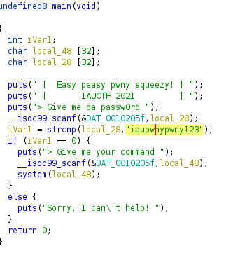
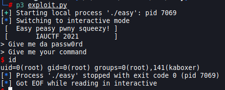

# Write up For easy challenge
## step-1
reverse engeering with ghidra or any tool My Fav tool is ghidra
use the decompile to read main funcation

Look at this

> We see when we run the program and put any input that checks whether it is a secret code or not, if it will open for me an input again. I put any command in it that it will execute using the system funcation

The secret code: iaupwnypwny123
## exploit

